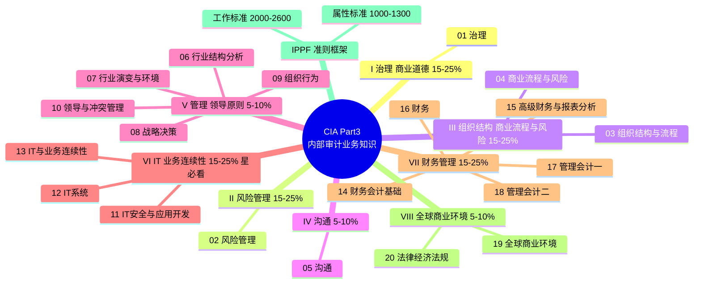

# CIA Part 3 内部审计业务知识 — 思维导图

> **用途**：复习时看全貌、人工检索时定位知识点。
> **怎么用**：① 下方 Mermaid 图看"板块→章"全貌；② 折叠大纲（正文列表）用于检索定位，每章可点链接直达教材原文；③ 知识点锚点细则见 [[_索引]]，准则条款见 [[IPPF索引]]。
> **权重**：⭐ = 必看重点（IT/业务连续性 15-25%，要求熟练水平）。

---

## 一、全貌图（Mermaid Mindmap）

> Obsidian 阅读视图自动渲染；若你的版本不支持 mermaid mindmap，用下方折叠大纲同样可看。

---

## 二、折叠大纲（检索用，Obsidian 大纲视图可折叠）

### I. 治理/商业道德（15-25%）
- [[教材原文/01-治理|01 治理]]
  - 1.1 治理概述
  - 1.2 内部审计师在治理过程中的作用
  - 1.3 环境与社会保护
  - 1.4 公司社会责任（CSR）

### II. 风险管理（15-25%）
- [[教材原文/02-风险管理|02 风险管理]]
  - 2.1 风险管理技术
  - 2.2 企业风险管理（ERM）

### III. 组织结构/商业流程与风险（15-25%）
- [[教材原文/03-组织结构与流程|03 组织结构与流程]]
  - 3.1 组织结构 · 3.2 部门化 · 3.3 集权与分权 · 3.4 供应链管理 · 3.5 业务流程分析
- [[教材原文/04-商业流程与风险|04 商业流程与风险]]
  - 4.1 管理存货成本与数量 · 4.2 存货管理方法 · 4.3 业务流程/风险 · 4.4 企业发展生命周期

### IV. 沟通（5-10%）
- [[教材原文/05-沟通|05 沟通]]
  - 5.1 沟通的本质 · 5.2 沟通中的问题 · 5.3 电子通信 · 5.4 利益相关者关系

### V. 管理/领导原则（5-10%）
- [[教材原文/06-行业内的结构分析|06 行业内的结构分析]]
  - 6.1 行业结构基础 · 6.2 行业结构分析 · 6.3 竞争战略 · 6.4 竞争分析 · 6.5 市场信号
- [[教材原文/07-行业演变与环境|07 行业演变与环境]]
  - 7.1 行业演变 · 7.2 零散型 · 7.3 新兴 · 7.4 衰退 · 7.5 全球性行业竞争
- [[教材原文/08-战略决策|08 战略决策]]
  - 8.1 一体化战略 · 8.2 产能扩张 · 8.3 进入新业务 · 8.4-8.6 预测（时间序列/概率/回归） · 8.7-8.10 质量管理（TQM）
- [[教材原文/09-组织行为|09 组织行为]]
  - 9.1 组织理论 · 9.2 激励 · 9.3 组织政治 · 9.4 群体动力学 · 9.5 群体发展阶段 · 9.6 管理人力资源
- [[教材原文/10-领导与冲突管理|10 领导与冲突管理]]
  - 10.1 领导风格 · 10.2 团队建设 · 10.3 冲突管理 · 10.4 谈判技巧 · 10.5 变革管理 · 10.6 项目管理

### VI. IT/业务连续性 ⭐必看（15-25%）
- [[教材原文/11-IT安全性和应用程序开发|11 IT安全性和应用程序开发]]
  - 11.1 物理与系统安全 · 11.2 信息保护 · 11.3 身份认证与加密 · 11.4 终端用户计算（EUC） · 11.5 程序变更控制 ⭐ · 11.6 应用程序开发 ⭐
- [[教材原文/12-IT系统|12 IT系统]]
  - 12.1 工作站与数据库 · 12.2 IT架构 · 12.3 自动化信息处理 · 12.4 系统基础设施
- [[教材原文/13-IT系统和业务连续性|13 IT系统和业务连续性]]
  - 13.1 系统软件 · 13.2 企业资源规划（ERP） · 13.3 IT基础设施 · 13.4 硬件 · 13.5 软件许可 · 13.6 应急计划 ⭐业务连续性

### VII. 财务管理（15-25%）
- [[教材原文/14-财务会计的基础和中级概念|14 财务会计的基础和中级概念]]
  - 14.1 财务会计概念 · 14.2 财务报表 · 14.3 权责发生制 · 14.4 会计流程 · 14.5 现金和应收账款 · 14.6 存货 · 14.7 固定资产和无形资产 · 14.8 货币时间价值
- [[教材原文/15-高级财务会计中的概念与财务报表分析|15 高级财务会计与财务报表分析]]
  - 15.1 养老金 · 15.2 租赁与或有事项 · 15.3 外币交易 · 15.4 企业合并 · 15.5 权益账户和合伙 · 15.6-15.11 财务报表分析（流动性/营运能力/偿债能力/投资回报/共同比）
- [[教材原文/16-财务|16 财务]]
  - 16.1 风险和回报 · 16.2 衍生金融工具 · 16.3-16.5 资本结构（债务/权益/资本成本） · 16.6 资本预算 · 16.7 现金管理和营运资本 · 16.8 短期融资
- [[教材原文/17-管理会计I|17 管理会计I]]
  - 17.1 成本术语 · 17.2 吸收与变动成本法 · 17.3 成本性态 · 17.4 预算系统 · 17.5 经营预算 · 17.6 转让定价
- [[教材原文/18-管理会计II|18 管理会计II]]
  - 18.1 本量利（CVP） · 18.2 相关成本 · 18.3 分步成本法 · 18.4 作业成本法（ABC） · 18.5 责任会计

### VIII. 全球商业环境（5-10%）
- [[教材原文/19-全球商业环境|19 全球商业环境]]
  - 19.1 全球商业发展概览 · 19.2 全球适应性 · 19.3 全球化运营领导 · 19.4 全球人力资源
- [[教材原文/20-法律、经济和法规问题|20 法律、经济和法规问题]]
  - 20.1 合同 · 20.2 经济指标 · 20.3 国际贸易 · 20.4 外币汇率和市场 · 20.5 税收方法 · 20.6 商业法规

### IPPF 准则框架（治理/风险/职业道德类题锚点）
- [[IPPF索引|IPPF 条款定位]]
  - **强制性指南**：使命 · 核心原则 · 定义 · 职业道德规范 · 《标准》
  - **属性标准（1000-1300）**：1100 独立性与客观性 ⭐ · 1110 组织独立性 · 1120 个人客观性 · 1130 客观性损害 · 1300 质量保证与改进程序（QAIP）⭐
  - **工作标准（2000-2600）**：2000 管理 · 2010 计划 · 2050 协调信赖 · 2100 工作性质 ⭐ · 2110 治理 ⭐ · 2120 风险管理 ⭐ · 2130 控制 ⭐ · 2200-2240 业务计划 · 2300-2340 实施 · 2400-2450 报告 · 2500 监督 · 2600 风险接受
  - **实施标准**：NNNN.Xn —— .A 确认业务 / .C 咨询业务
  - 正文：[[教材原文/IPPF红皮书_clean|红皮书解读（5章主题式）]] · [[教材原文/IPPF官方版2017_clean|官方原文（条文式，措辞为准）]]

---

## 三、大纲板块对照（兆泰/应试指南）

> 官方大纲四板块是另一套组织维度，题目按"大纲板块"表述时用这组锚点（详见 [[_索引]]）。

- **I. 业务敏感度 35%** → [[教材原文/兆泰知识要素_clean#L239|兆泰]] · [[教材原文/应试指南_clean#L583|应试指南第1章]]
  - 组织目标/行为/绩效 · 组织结构与业务流程 · 数据分析
- **II. 信息安全 25%** → [[教材原文/兆泰知识要素_clean#L7638|兆泰]] · [[教材原文/应试指南_clean#L3742|应试指南第2章]]
  - 物理安全 · 认证授权 · 信息安全控制 · 数据隐私法 · 新兴技术 · 网络安全风险/政策
- **III. 信息技术 20%** → [[教材原文/兆泰知识要素_clean#L9733|兆泰]] · [[教材原文/应试指南_clean#L5123|应试指南第3章]]
  - 应用与系统软件 · IT基础设施与IT控制框架 · 灾难恢复与业务持续性
- **IV. 财务管理 20%** → [[教材原文/兆泰知识要素_clean#L12996|兆泰]] · [[教材原文/应试指南_clean#L7141|应试指南第4章]]
  - 财务会计与财务管理 · 管理会计
- **考试大纲**（官方 Syllabus）→ [[教材原文/兆泰知识要素_clean#L19617|兆泰附录]] · [[教材原文/应试指南_clean#L10075|应试指南附录1]]

---

> **检索路径速记**：业务知识题 → 上方折叠大纲锁章 → 开章文件精讲；治理/风险/职业道德题 → IPPF 分支 → [[IPPF索引]] 锁条款 → 跳原文。错题记录见 [[错题库/_汇总]]。

> ⚠️ **链接说明**：本实例中的 [[IPPF索引]]、[[教材原文/...]] 等链接指向本地完整知识库内容（IPPF 索引与教材原文按版权要求不在公开仓库）。考生按 START-HERE 建档并摄入自己的教材后，这些链接在本地即恢复可用；公开仓库中它们为无效链接，属预期。
